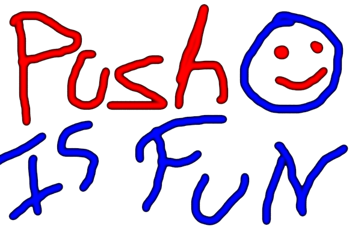
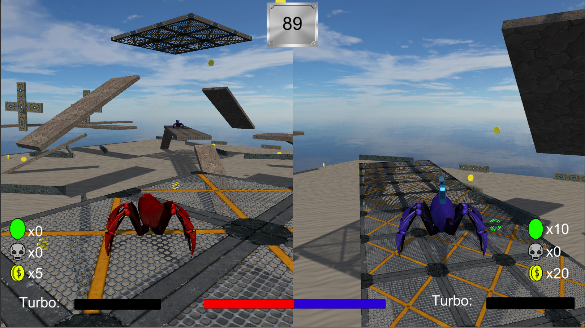
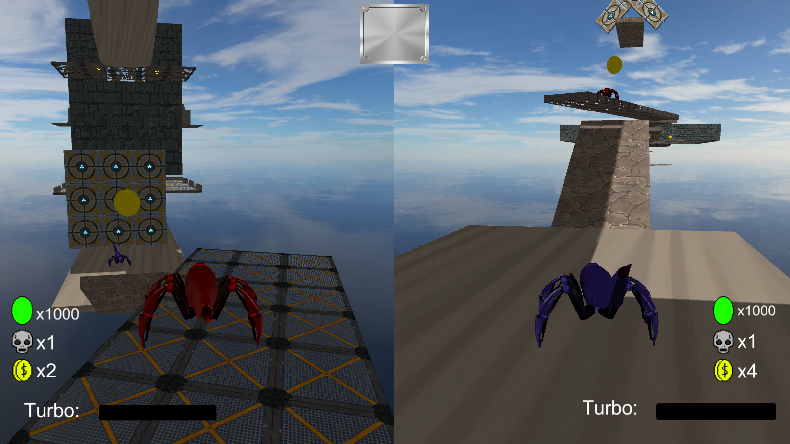
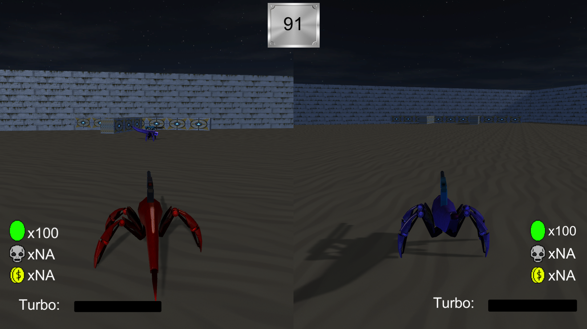

# Push is Fun

Descripcion:
Push is Fun es un juego realizado para la materia de Desarrollo de Videojuegos II, 
es un competitivo de 2 jugadores, los cuales podran elejir
3 modos diferentes en los que tendran que competir entre si de diferentes formas.

Primer Modo (Captura el punto):

Los jugadores deberan capturar un punto y defederlo por un cierto tiempo,los jugadores deberan colocarse sobre el objetivo y asi llenar una barra de progreso, al finalizar el tiempo el jugador que halla llenado mas la barra con su color sera el ganador.

Segundo Modo (Carrera de obtaculos):

Los jugadores deberan atravezar un recorrido lleno de obstaculos y plataformas para llegar a una meta, el jugador que llegue primero sera el ganador.

Tercer Modo (Supervivencia):

En este modo los jugadores deberan derribar al otro empujandolo fuera de las plataformas, tendran un tiempo para hacerlo y cuando este acabe el jugador que halla derribado mas al otro sera el ganador.

# Credits

Programacion
Amarilla Rodrigo

Diseño de nivel
Amarilla Rodrigo

Modelos 3D
SciFi Enemies and Vehicles de Popup Asylum
https://assetstore.unity.com/packages/3d/characters/robots
/scifi-enemies-and-vehicles-15159
Scifi Assault de SunixDev
https://assetstore.unity.com/publishers/15417

Texturas
Tileable Pack 01 de Mafubash
https://assetstore.unity.com/packages/2d/textures-materials
/floors/tileable-pack-01-49278
Yughues Free Metal Materials de Nobiax / Yughues
https://assetstore.unity.com/packages/2d/textures-materials
/metals/yughues-free-metal-materials-12949

Fonts
Astron Boy Wonder de Typodermic Fonts
https://www.1001freefonts.com/es/astron-boy-wonder.font

Audio
Amarilla Rodrigo
Happy Sounds by Mativve de Mativve
https://freesound.org/people/Mativve/sounds/391538/
hejdå - Depressive Guitar de edtijo
https://freesound.org/people/edtijo/sounds/238913/
FightScene de Darkmast49
https://freesound.org/people/Darkmast49/sounds/157846/
Random Music Shorts de luckylittleraven
https://freesound.org/people/luckylittleraven/sounds/202221/

Skyboxs
Free Skybox Texture Set de 93-interactive
https://93i.de/p/free-skybox-texture-set/

# Links

Trello:
https://trello.com/b/qODlaD9P/primer-tp-desarrolo-2

Itch.io:
https://zerhe.itch.io/pushisfun
